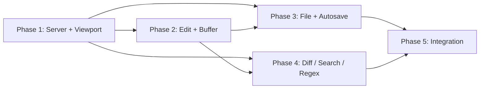

# Synced from GitHub Issue #4 at 2026-05-26T14:06:27-04:00
# [PLAN] MVP: Viewport-Editor MCP Server

Spec: #1 — 35 behavioral SCs across 6 tools, per-viewport autosave toggle, session isolation, conflict detection, connection loss cleanup.

## Goal

Build a production-ready MCP server providing a windowed viewport editor with 6 consolidated tools (viewport, edit, file, diff, search, regex) supporting per-viewport autosave toggle (on/off), session isolation, conflict detection, connection loss cleanup (SC-35), and prose+YAML throughout.

## Verification Mandate

All verification in this plan follows the spec's cost model (see Issue #1 §Verification Mandate). Every SC is `behavioral` — structural or string evidence (grep, ls, file-existence) is EVIDENCE_TYPE_MISMATCH treated as FAIL. Each phase's behavioral test must execute real runtime code and observe the output. The cost of a behavioral test is the one-time execution cost; the cost of an undiscovered defect shipped by a false PASS is unbounded rework.

## Architecture

Single buffer path with per-viewport autosave flag:

- **Session layer** (`session.py`): per-connection state, buffer registry, viewport registry, session IDs for lifecycle cleanup
- **Viewport layer** (`viewport.py`): window management, scroll, page, jump, autosave toggle, session destroy
- **Buffer layer** (`buffer.py`): in-memory line buffers, diff tracking, staleness checks, autosave flush
- **Operation layer** (`editor.py`, `file_ops.py`, `diff_engine.py`, `search.py`, `regex_ops.py`): edit/file/diff/search/regex actions, all operating through buffer
- **Conflict layer** (`conflict.py`): soft warning on ops, hard block on save
- **Server layer** (`server.py`): MCP tool registration, request dispatch, response formatting, lifespan shutdown for session cleanup
- **Exceptions layer** (`exceptions.py`): domain-specific exceptions for isError=true propagation

No bifurcated mode paths. All edits stage into buffer. Autosave=on triggers flush after each operation. Autosave=off requires explicit `file:save`.

## Tech Stack

- Python 3.12+ with MCP SDK
- Pydantic for data models
- Unified diff (built-in `difflib`) for diff display
- pytest for test suite

## File Structure

| File | Responsibility |
|------|----------------|
| `src/viewport_editor/server.py` | MCP server class, tool registration, dispatch routing, response formatting, lifespan shutdown |
| `src/viewport_editor/viewport.py` | Viewport model, registry, open/close/list/scroll/page/jump/autosave operations, autosave flag, session destroy |
| `src/viewport_editor/buffer.py` | Buffer model, line-level edits, diff tracking, mtime/size staleness state, autosave flush |
| `src/viewport_editor/editor.py` | Edit operations: replace, replace-all, insert-lines, delete-lines, swap-lines, move-lines |
| `src/viewport_editor/file_ops.py` | File operations: new, save, save-as, delete, discard |
| `src/viewport_editor/diff_engine.py` | Diff operations: show unified diff, apply diff to buffer |
| `src/viewport_editor/search.py` | Search operations: find with substring/regex/case options |
| `src/viewport_editor/regex_ops.py` | Regex operations: test patterns, escape metacharacters |
| `src/viewport_editor/session.py` | Session state container, buffer/viewport registry per session, session ID enumeration |
| `src/viewport_editor/conflict.py` | Conflict detection: soft check on file staleness, hard check on save |
| `src/viewport_editor/exceptions.py` | Domain exceptions for action-specific error semantics |

## Phase Prerequisites

| Phase | Requires | Rationale |
|-------|----------|-----------|
| P1 | nothing | Foundation — server, viewport, session, exceptions |
| P2 | P1 | Needs viewport model, session isolation, conflict layer |
| P3 | P1, P2 | Needs buffer model and edit pipeline |
| P4 | P1, P2 | Needs server (tool registration), buffer model (diff:apply), viewport (search scope) |
| P5 | P3, P4 | Integration — all tools operational; transitively requires P1, P2 |

## Dependencies

Solid arrow: full phase dependency (phase cannot start without it).

## Phases

---

### Phase 1: Server Foundation + Viewport Tool

**Concern:** Core server infrastructure and the viewport management subsystem — the foundation everything else builds on.

**SCs covered:** SC-1, SC-2, SC-3, SC-4, SC-5, SC-6, SC-7, SC-8, SC-25, SC-26, SC-27, SC-31, SC-32, SC-33, SC-34, SC-35

SC-31 (viewport:scroll by N lines) is a viewport operation. SC-32 (viewport:autosave toggle) is a viewport operation. SC-33 (viewport:list returns all fields) is a viewport operation. SC-34 (relative file paths) is a server-level sanitization concern. SC-35 (connection loss cleanup) is a session lifecycle concern.

**What it must accomplish:**
- MCP server scaffold with FastMCP, exposing exactly 6 tools with action parameters
- Tool descriptions and responses in prose+YAML format (no JSON in agent-readable content)
- File path sanitization to project-relative only; absolute paths rejected (SC-34)
- Session isolation: per-connection state containers
- Viewport model with file, start_line, end_line, mtime, size, autosave (on/off, default off), dirty/clean state
- Autosave flag persisted in viewport entries and reflected in viewport:list
- viewport:open with autosave parameter (on/off); defaults to off
- viewport:close with auto-save when dirty
- viewport:list returning all open viewports with entries showing file, range, mtime, size, autosave (SC-33)
- viewport:scroll by N lines up/down (SC-31)
- viewport:page-up/page-down by viewport height
- viewport:jump by line number, function name, markdown heading, search result; returns isError=true on failure (SC-27)
- viewport:autosave toggles autosave flag on an open viewport without closing it. If buffer is dirty and autosave is turned on, flushes buffer immediately. (SC-32)
- Soft conflict warning on viewport operations (mtime/size check, including missing-file case)
- Session isolation: two sessions can edit the same file without collision (per-session buffer isolation)
- Domain exceptions hierarchy for action-specific error handling with FastMCP isError=true (SC-27)
- SC-35: On connection loss (via available lifecycle mechanisms: lifespan shutdown, stale-session sweep), all dirty buffers discarded — zero saves. Sessions released. FastMCP SDK constraint: no per-connection disconnect hook; cleanup relies on transport-dependent mechanisms.

**TDD approach:**
1. RED: Write behavioral tests that verify MCP tool exposure (6 tools), prose+YAML format, no help tool, path sanitization
2. Write session and viewport models with tests
3. Implement viewport operations one action at a time with RED→GREEN per action (open, close, list, scroll, page-up, page-down, jump, autosave)
4. Add conflict detection with tests for soft warning behavior
5. Add session isolation tests (parallel sessions, same file, independent buffers)
6. Add RED tests for SC-31 (scroll by N lines), SC-32 (autosave toggle), SC-33 (viewport:list fields), SC-34 (relative paths only)
7. Add domain exceptions and isError=true propagation for jump errors
8. Implement session destroy handler for SC-35 lifecycle cleanup

**How to verify (cost frame):**
All verifications are behavioral — structural or string evidence is EVIDENCE_TYPE_MISMATCH. Every test executes real runtime code and observes the output.

**Before adversarial audit dispatch:** capture behavioral evidence per Issue #1 §Behavioral Evidence Capture Protocol (e.g., `uv run pytest test/ -k "phase1" > ./tmp/behavioral-evidence-{phase}-{label}.log 2>&1`).

- Behavioral test: MCP server starts, list_tools returns 6 tools with action parameters (SC-1)
- Behavioral test: no dedicated help tool exists (SC-2)
- Behavioral test: tool descriptions use prose+YAML, no JSON (SC-3)
- Behavioral test: absolute path rejected, relative path accepted (SC-4, SC-34)
- Behavioral test: viewport:open returns viewport_entry with all fields including autosave (SC-5)
- Behavioral test: open with autosave=on persists; default is off (SC-6)
- Behavioral test: page-up/down moves viewport by correct amount (SC-7, SC-8)
- Behavioral test: scroll by N lines up and down (SC-31)
- Behavioral test: viewport:autosave toggles flag without closing viewport; flushes dirty buffer if turning on (SC-32)
- Behavioral test: viewport:list returns correct entries with all fields (SC-33)
- Behavioral test: N concurrent sessions with same file produce independent buffers (SC-26)
- Behavioral test: soft conflict warning triggers on stale or missing file (SC-25)
- Behavioral test: jump returns isError=true on target not found (SC-27)
- Behavioral test: session destroy discards dirty buffers without saving (SC-35)

`uv run pytest test/ -k "phase1"` passes all phase 1 tests.

---

### Phase 2: Edit Tool + Buffer Model

**Concern:** The core editing subsystem — edits always stage into buffer, inspected via diff, flushed on explicit save or autosave.

**SCs covered:** SC-9, SC-10, SC-11, SC-12, SC-13, SC-18, SC-19, SC-20, SC-21, SC-22, SC-23, SC-25

SC-25 (soft conflict warning on edit operations) is covered here via the shared conflict layer from Phase 1.

**What it must accomplish:**
- Buffer model: line-based in-memory representation, tracks original vs pending state
- After each edit: if viewport has autosave=on, flush buffer to disk atomically
- edit:replace — stages into buffer (always)
- edit:replace-all — stages all matches into buffer
- edit:insert-lines at line number — stages into buffer
- edit:delete-lines range — stages into buffer
- edit:swap-lines — stages into buffer
- edit:move-lines — stages into buffer
- diff:show returning unified diff of pending buffer changes
- file:save with hard mtime/size conflict check (reject unless force)
- file:discard discarding buffer and reloading from disk
- Soft conflict warning on edit operations via shared conflict layer from Phase 1 (SC-25)

**TDD approach:**
1. RED: Write buffer model tests (empty buffer, apply edits, compute diff)
2. Implement edit operations one action at a time, each with RED→GREEN
3. RED: Verify edit:replace stages without writing to disk (autosave=off)
4. GREEN: Implement buffer-backed edit pipeline
5. RED: Verify edit:replace with autosave=on writes to disk atomically
6. GREEN: Implement autosave flush after edit
7. RED: Verify diff:show returns correct unified diff
8. RED: Verify file:save rejects on mtime/size mismatch; file:discard reverts buffer

**How to verify (cost frame):**
All verifications are behavioral — structural or string evidence is EVIDENCE_TYPE_MISMATCH. Every test executes real runtime code and observes the output.

**Before adversarial audit dispatch:** capture behavioral evidence per Issue #1 §Behavioral Evidence Capture Protocol (e.g., `uv run pytest test/ -k "phase2" > ./tmp/behavioral-evidence-{phase}-{label}.log 2>&1`).

- Behavioral test: edit:replace stages into buffer, does not write to disk when autosave=off (SC-9)
- Behavioral test: diff:show returns correct unified diff of pending changes (SC-10)
- Behavioral test: file:save with mtime mismatch returns error (SC-11)
- Behavioral test: file:discard reloads original content (SC-12)
- Behavioral test: with autosave=on, each edit flushes to disk atomically (SC-13)
- Behavioral test: soft conflict warning on edit operations (SC-25)

`uv run pytest test/ -k "phase2"` passes all phase 2 tests.

---

### Phase 3: File Operations + Autosave Integration

**Concern:** File creation, deletion, save-as, and the autosave=on behavior integration.

**SCs covered:** SC-14, SC-15, SC-16, SC-24

**What it must accomplish:**
- With autosave=on: file:save is no-op (buffer already flushed), diff:show returns empty, file:discard returns empty state (SC-14)
- file:new creates file on disk and opens viewport with autosave=off (SC-15)
- file:save-as with force=false rejects if target exists (SC-16)
- file:save-as with force=true overwrites
- file:delete removes file on disk
- viewport:close with dirty buffer auto-saves (default) (SC-24)

**TDD approach:**
1. RED: Write behavioral tests for autosave=on no-op behavior (file:save, diff:show, file:discard)
2. Implement autosave=on gate in each operation
3. RED: Test file:new creates file and opens viewport
4. GREEN: Implement file:new, file:save-as, file:delete
5. RED: Test save-as with force vs no-force behavior

**How to verify (cost frame):**
All verifications are behavioral — structural or string evidence is EVIDENCE_TYPE_MISMATCH. Every test executes real runtime code and observes the output.

**Before adversarial audit dispatch:** capture behavioral evidence per Issue #1 §Behavioral Evidence Capture Protocol (e.g., `uv run pytest test/ -k "phase3" > ./tmp/behavioral-evidence-{phase}-{label}.log 2>&1`).

- Behavioral test: with autosave=on, file:save/diff:show/discard return empty state (SC-14)
- Behavioral test: file:new creates file and opens viewport with autosave=off (SC-15)
- Behavioral test: file:save-as with force=false rejects existing target (SC-16)
- Behavioral test: file:delete removes file
- Behavioral test: viewport:close with dirty buffer auto-saves (SC-24)

`uv run pytest test/ -k "phase3"` passes all phase 3 tests.

---

### Phase 4: Diff, Search, and Regex Tools

**Concern:** Auxiliary tools that support the editing workflow — diff:apply for importing diffs, search:find for locating text, and regex:test/regex:escape.

**SCs covered:** SC-17, SC-23, SC-28, SC-29

**What it must accomplish:**
- diff:apply stages a unified diff into buffer; auto-loads file if not open (SC-23)
- search:find returns structured results with line numbers (SC-17)
- search:find substring by default, regex with flag
- regex:test returns match positions (SC-28)
- regex:escape returns escaped string (SC-29)

**TDD approach:**
1. RED: Write diff:apply tests (valid diff, fuzzy context matching, auto-load file)
2. Implement diff:apply with unified diff parser
3. RED: Write search:find tests (substring, regex, case-sensitive, scope filtering)
4. Implement search:find
5. RED: Write regex:test and regex:escape tests
6. Implement regex:test and regex:escape

**How to verify (cost frame):**
All verifications are behavioral — structural or string evidence is EVIDENCE_TYPE_MISMATCH. Every test executes real runtime code and observes the output.

**Before adversarial audit dispatch:** capture behavioral evidence per Issue #1 §Behavioral Evidence Capture Protocol (e.g., `uv run pytest test/ -k "phase4" > ./tmp/behavioral-evidence-{phase}-{label}.log 2>&1`).

- Behavioral test: diff:apply stages correct changes into buffer; auto-loads file (SC-23)
- Behavioral test: search:find returns line numbers for substring match, regex with flag (SC-17)
- Behavioral test: regex:test returns match positions (SC-28)
- Behavioral test: regex:escape escapes metacharacters correctly (SC-29)

`uv run pytest test/ -k "phase4"` passes all phase 4 tests.

---

### Phase 5: Integration Tests

**Concern:** End-to-end integration testing across all subsystems.

**SCs covered:** Integration coverage for all prior phase SCs

**What it must accomplish:**
- Integration test: open file → edit → diff → save → verify disk matches
- Integration test: open with autosave=on → edit → verify disk changed immediately → diff:show returns empty
- Integration test: open → edit with autosave=off → toggle autosave=on → verify flush and subsequent edits auto-flush
- Integration test: N concurrent sessions with same file, each with independent buffers and correct conflict detection (SC-26)
- Integration test: conflict detection triggers save rejection (SC-25)
- Integration test: full workflow (open → insert → replace-all → swap → diff → save → close)

**TDD approach:**
1. RED: Write integration test for full workflow
2. GREEN: All prior phases should already make this pass
3. Run full test suite: `uv run pytest test/`

**How to verify (cost frame):**
All verifications are behavioral — structural or string evidence is EVIDENCE_TYPE_MISMATCH. Every test executes real runtime code and observes the output.

**Before adversarial audit dispatch:** capture behavioral evidence per Issue #1 §Behavioral Evidence Capture Protocol (e.g., `uv run pytest test/ -k "phase5" > ./tmp/behavioral-evidence-{phase}-{label}.log 2>&1`).

- `uv run pytest test/` passes all tests (full suite)
- Behavioral test: three+ concurrent sessions with same file produce independent buffers with correct conflict detection

---

## Risk Notes

- All SCs are `behavioral` by design per the spec's Verification Mandate. No structural or string evidence accepted. Every verification step executes real runtime code and observes the output. This is not negotiable — the cost of a behavioral test is the one-time execution cost; the cost of an undiscovered defect is unbounded rework.
- **Behavioral evidence artifacts:** All test results MUST produce saved behavioral evidence artifacts in `./tmp/behavioral-evidence-*.log` before every adversarial audit pass. See Issue #1 §Behavioral Evidence Capture Protocol. Prior `./tmp/artifacts/` convention is superseded by the spec's behavioral evidence protocol.
- **Audit dispatch without behavioral evidence artifact is a procedural defect:** Before each adversarial audit dispatch, run the phase's test suite and redirect output to `./tmp/behavioral-evidence-{phase}-{label}.log`. The audit sub-agents receive the artifact path as PRIMARY evidence; structural reads (file contents, issue bodies) are SECONDARY corroboration only. If an audit is dispatched without a corresponding evidence artifact, the audit MUST be halted and the artifact generated before proceeding.
- **SC-35 limitation:** FastMCP provides no per-connection disconnect hooks. Session cleanup fires on server lifespan shutdown and stale-session sweep (4-hour idle timeout). For stdio transport (the common MCP mode), client disconnect closes stdin → process exits → lifespan fires. For SSE/streamable HTTP, sessions are orphaned until server restart or stale-sweep eviction. This is an SDK constraint, not a design defect.

---

STATUS: draft

🤖 Co-authored with AI: OpenCode (ollama-cloud/deepseek-v4-flash)
