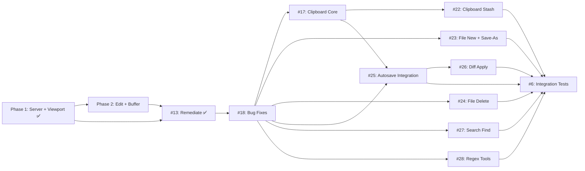

# [PLAN] MVP: Viewport-Editor MCP Server

Spec: #1 — 38 behavioral SCs across 6 tools, per-viewport autosave toggle, session isolation, conflict detection, session lifecycle (SC-35), line ending detection, display mode toggle (hide/show non-printing characters).

## Goal

Build a production-ready MCP server providing a windowed viewport editor with 6 consolidated tools (viewport, edit, file, diff, search, regex) supporting per-viewport autosave toggle (on/off), session isolation, conflict detection, session lifecycle cleanup (SC-35), line ending detection (SC-36), display mode toggle (SC-37, SC-38), and prose+YAML throughout. Every position-changing viewport action returns visible text content in cat -n format.

## Verification Mandate

All verification in this plan follows the spec's cost model (see Issue #1 §Verification Mandate). Every SC is `behavioral` — structural or string evidence (grep, ls, file-existence) is EVIDENCE_TYPE_MISMATCH treated as FAIL. Each phase's behavioral test must execute real runtime code and observe the output. The cost of a behavioral test is the one-time execution cost; the cost of an undiscovered defect shipped by a false PASS is unbounded rework.

Behavioral evidence MUST be captured to artifact files per the spec's Behavioral Evidence Capture Protocol: `uv run pytest test/ -k "phase" > ./tmp/behavioral-evidence-phase.log 2>&1`. Evidence artifacts are exempt from ./tmp/ cleanup and survive until PR merge.

## Regression Principle

Every phase after Phase 1 builds on shared infrastructure (server.py, viewport.py, conflict.py, session.py). A change in any later phase can silently break prior phase functionality. Therefore:

- **Cumulative regression guard:** Each phase after P1 MUST run the full cumulative test suite for all completed prior phases alongside its own tests.
- **P2 regression:** `uv run pytest test/ -k "phase1 or phase2"` — P1 tests + P2 tests.
- **P3 regression:** `uv run pytest test/ -k "phase1 or phase2 or phase3"` — P1 + P2 + P3 tests.
- **P4 regression:** `uv run pytest test/ -k "phase1 or phase2 or phase4"` — P1 + P2 + P4 tests.
- **P5 regression:** `uv run pytest test/` — full suite.
- **A P2 change that breaks P1 is caught at P2 verification time**, not delayed to P5.
- Behavioral evidence artifacts for the regression pass are captured separately: `./tmp/behavioral-evidence-regression-phase.log` confirming all cumulative tests pass.

## Architecture

Single buffer path with per-viewport autosave flag:

- **Session layer** (`session.py`): per-connection state, buffer registry, viewport registry, session IDs for lifecycle cleanup
- **Viewport layer** (`viewport.py`): window management, scroll, page, jump, autosave toggle, display mode toggle, line ending detection on open, session destroy, get_visible_lines()
- **Buffer layer** (`buffer.py`): in-memory line buffers, diff tracking, staleness checks, autosave flush
- **Operation layer** (`editor.py`, `file_ops.py`, `diff_engine.py`, `search.py`, `regex_ops.py`): edit/file/diff/search/regex actions, all operating through buffer
- **Conflict layer** (`conflict.py`): soft warning on ops, hard block on save
- **Server layer** (`server.py`): MCP tool registration, request dispatch, response formatting, _format_content_block() for cat -n visible text display, lifespan shutdown for session cleanup
- **Exceptions layer** (`exceptions.py`): domain-specific exceptions for isError=true propagation

No bifurcated mode paths. All edits stage into buffer. Autosave=on triggers flush after each operation. Autosave=off requires explicit `file:save`.

## File Structure

| File | Responsibility |
|------|----------------|
| `src/viewport_editor/server.py` | MCP server class, tool registration, dispatch routing, response formatting, _format_content_block(), lifespan shutdown |
| `src/viewport_editor/viewport.py` | Viewport model, registry, open/close/list/scroll/page/jump/autosave operations, autosave flag, display mode toggle, line ending detection, session destroy, get_visible_lines() |
| `src/viewport_editor/buffer.py` | Buffer model, line-level edits, diff tracking, mtime/size staleness state, autosave flush |
| `src/viewport_editor/editor.py` | Edit operations: replace, replace-all, insert-lines, delete-lines, swap-lines, move-lines |
| `src/viewport_editor/file_ops.py` | File operations: new, save, save-as, delete, discard |
| `src/viewport_editor/diff_engine.py` | Diff operations: show unified diff, apply diff to buffer |
| `src/viewport_editor/search.py` | Search operations: find with substring/regex/case options |
| `src/viewport_editor/regex_ops.py` | Regex operations: test patterns, escape metacharacters |
| `src/viewport_editor/session.py` | Session state container, buffer/viewport registry per session, session ID enumeration |
| `src/viewport_editor/conflict.py` | Conflict detection: soft check on file staleness, hard check on save |
| `src/viewport_editor/exceptions.py` | Domain exceptions for action-specific error semantics |

## Implementation Ordering (Z3-Verified)

Each issue is a single-concern unit. Issues can be approved and implemented sequentially. Parallel opportunities noted below.

| Order | Issue | Title | SCs | Depends On | Feature Branch |
|-------|-------|-------|-----|------------|----------------|
| 1 | #18 | Bug Fixes (CRLF, mkstemp, close, tests) | SC-LF-1, SC-TMP-1, SC-24, SC-36, SC-38, SC-TEST-ATOMIC, SC-TEST-UNICODE, SC-REG | None | `feature/18-crlf-mkstemp-fix` |
| 2 | #17 | Clipboard Core (copy/cut/paste) | SC-39, SC-40, SC-41, SC-42, SC-46, SC-48 | #18 | `feature/p3-clipboard-core` |
| 3 | #22 | Clipboard Stash (stash/pop/swap/list) | SC-43, SC-44, SC-45, SC-47 | #17 | `feature/p3-stash` |
| 4 | #23 | File New + Save-As | SC-15, SC-16, SC-LF-2, SC-TMP-2, SC-LF-3 | #18 | `feature/p3-filenew-saveas` |
| 5 | #24 | File Delete | SC-30 | #18 | `feature/p3-file-delete` |
| 6 | #25 | Autosave Integration | SC-14 | #18, #17 | `feature/p3-autosave` |
| 7 | #26 | Diff Apply | SC-23 | #25 | `feature/p4-diff-apply` |
| 8 | #27 | Search Find | SC-17 | #18 | `feature/p4-search-find` |
| 9 | #28 | Regex Tools | SC-28, SC-29 | #18 | `feature/p4-regex-tools` |
| 10 | #6 | Integration Tests | All prior SCs | All prior issues | `feature/p5-integration` |

**Parallel opportunities (Z3 permits):**
- #23 and #24 can proceed in parallel after #18 (no cross-dependency)
- #27 and #28 can proceed in parallel after #18 (no cross-dependency)
- #27 and #28 can proceed in parallel with #25 (no cross-dependency)

**Z3 contract:** `.issues/4/spec-artifacts/dependency-contract.yaml`

**Decomposed issues (closed as superseded):**
- #5 (Phase 3 monolith) → #23 + #24 + #25
- #8 (Phase 4 monolith) → #26 + #27 + #28

### SC-to-Issue Traceability

| SC | Issue | Description |
|----|-------|-------------|
| SC-1 through SC-13 | ✅ Implemented (Phase 1+2) | Server, viewport, edit, buffer, file:save/discard |
| SC-14 | #25 | Autosave=on no-op for file:save/diff:show/discard |
| SC-15 | #23 | file:new creates file, opens viewport with autosave=off |
| SC-16 | #23 | file:save-as with force=false/true |
| SC-17 | #27 | search:find returns structured results |
| SC-18 through SC-22 | ✅ Implemented (Phase 2) | edit:replace-all, insert/delete/swap/move-lines |
| SC-23 | #26 | diff:apply stages diff into buffer |
| SC-24 | #18 | Close auto-saves dirty buffer (bug fix) + #25 (integration) |
| SC-25 through SC-27 | ✅ Implemented (Phase 2) | Soft conflict warning, session isolation, jump error |
| SC-28 | #28 | regex:test returns match positions |
| SC-29 | #28 | regex:escape escapes metacharacters |
| SC-30 | #24 | file:delete removes file on disk |
| SC-31 through SC-35 | ✅ Implemented (Phase 2) | scroll, page, autosave toggle, list, relative paths |
| SC-36 | #18 | CRLF round-trip end-to-end test |
| SC-37 | ✅ Implemented (Phase 2) | Display mode toggle |
| SC-38 | #18 | Unicode decode behavioral test |
| SC-39 | #17 | copy with provenance |
| SC-40 | #17 | cut + stages deletion |
| SC-41 | #17 | paste insert-before |
| SC-42 | #17 | cut/paste autosave gate + diff response |
| SC-43 | #22 | stash |
| SC-44 | #22 | pop |
| SC-45 | #22 | swap |
| SC-46 | #17 | paste never reads from stash |
| SC-47 | #22 | stash list |
| SC-48 | #17 | line-aligned ranges only |
| SC-LF-1 | #18 | flush_entry newline="" |
| SC-LF-2 | #23 | save-as newline="" |
| SC-LF-3 | #23 | file:new newline="" |
| SC-TMP-1 | #18 | flush_entry mkstemp |
| SC-TMP-2 | #23 | save-as mkstemp |
| SC-TEST-ATOMIC | #18 | Enhanced atomic write behavioral test |
| SC-TEST-UNICODE | #18 | Unicode decode behavioral test |
| SC-REG | #18 | All 51 tests pass |

## Phase Prerequisites (Original)

| Phase | Requires | Rationale |
|-------|----------|-----------|
| P1 | nothing | Foundation — server, viewport, session, exceptions |
| P2 | P1 | Needs viewport model, session isolation, conflict layer |
| #13 | P1, P2 | Fixes atomic write + unicode decode before buffer-touching phases |
| #18 | P1, P2, #13 | Bug fixes for CRLF/mkstemp/close — blocks everything downstream |
| #17 | #18 | Clipboard core depends on fixed buffer behavior |
| #22 | #17 | Clipboard stash depends on primary clipboard register |
| #23 | #18 | File new/save-as depends on fixed flush_entry |
| #24 | #18 | File delete depends on fixed file_ops |
| #25 | #18, #17 | Autosave integration depends on clipboard autosave gate patterns |
| #26 | #25 | Diff apply depends on autosave gate |
| #27 | #18 | Search depends on fixed unicode decode |
| #28 | #18 | Regex depends on fixed file_ops |
| #6 | All prior | Integration tests require all tools operational |

## Dependencies

Solid arrow: full dependency (issue cannot start without predecessor completing).

## Phases (Original — Preserved)

---

### Phase 1: Server Foundation + Viewport Tool ✅ COMPLETE

**Concern:** Core server infrastructure and the viewport management subsystem.

**SCs covered:** SC-1, SC-2, SC-3, SC-4, SC-5, SC-6, SC-7, SC-8, SC-25, SC-26, SC-27, SC-31, SC-32, SC-33, SC-34, SC-35, SC-36, SC-37, SC-38
(SC-36, SC-37, SC-38 added during audit remediation — line ending detection, display mode toggle, show mode input)

SC-35 is implemented via server lifecycle bound to stdio transport: lifespan shutdown discards all dirty buffers (zero saves); stale-session sweep reclaims orphaned sessions from agent restart without clean teardown.

**How to verify:** `uv run pytest test/ -k "phase1" > ./tmp/behavioral-evidence-phase1.log 2>&1` — 36 tests pass.

---

### Phase 2: Edit Tool + Buffer Model

**Concern:** The core editing subsystem — edits always stage into buffer, inspected via diff, flushed on explicit save or autosave.

**SCs covered:** SC-9, SC-10, SC-11, SC-12, SC-13, SC-18, SC-19, SC-20, SC-21, SC-22, SC-25

**What it must accomplish:**
- Buffer model: line-based in-memory representation, tracks original vs pending state
- After each edit: if viewport has autosave=on, flush buffer to disk atomically
- edit:replace stages into buffer (always)
- edit:replace-all stages all matches into buffer
- edit:insert-lines at line number
- edit:delete-lines range
- edit:swap-lines and edit:move-lines
- diff:show returning unified diff of pending buffer changes
- file:save with hard mtime/size conflict check (reject unless force)
- file:discard discarding buffer and reloading from disk
- Soft conflict warning on edit operations via shared conflict layer from Phase 1 (SC-25)
- Preserve original line endings (\n, \r\n, \r) through edit operations

**Verification mandate:** All SCs are behavioral. Structural or string evidence for any behavioral SC is EVIDENCE_TYPE_MISMATCH treated as FAIL. Behavioral tests must execute real runtime code (pytest) and observe the output.

**How to verify (behavioral):**
1. `uv run pytest test/ -k "phase2" > ./tmp/behavioral-evidence-phase2.log 2>&1` — all phase 2 tests pass
2. `uv run pytest test/ -k "phase1 or phase2" > ./tmp/behavioral-evidence-regression-phase2.log 2>&1` — P1 tests still pass after P2 changes (cumulative regression guard)

---

### Phase 3: File Operations + Autosave Integration

**SCs covered:** SC-14, SC-15, SC-16, SC-24

> **Note:** This phase has been decomposed into single-concern issues for cleaner implementation:
> - **#23** — File New + Save-As (SC-15, SC-16, SC-LF-2, SC-TMP-2, SC-LF-3)
> - **#24** — File Delete (SC-30)
> - **#25** — Autosave Integration (SC-14, SC-24)
> See the Implementation Ordering table above for dependency details.

**Verification mandate:** All SCs are behavioral. Structural or string evidence for any behavioral SC is EVIDENCE_TYPE_MISMATCH treated as FAIL.

**How to verify (behavioral):**
1. `uv run pytest test/ -k "phase3" > ./tmp/behavioral-evidence-phase3.log 2>&1` — all phase 3 tests pass
2. `uv run pytest test/ -k "phase1 or phase2 or phase3" > ./tmp/behavioral-evidence-regression-phase3.log 2>&1` — P1+P2 tests still pass after P3 changes

---

### Phase 4: Diff, Search, and Regex Tools

**SCs covered:** SC-17, SC-23, SC-28, SC-29

> **Note:** This phase has been decomposed into single-concern issues for cleaner implementation:
> - **#26** — Diff Apply (SC-23)
> - **#27** — Search Find (SC-17)
> - **#28** — Regex Tools (SC-28, SC-29)
> See the Implementation Ordering table above for dependency details.

**Verification mandate:** All SCs are behavioral. Structural or string evidence for any behavioral SC is EVIDENCE_TYPE_MISMATCH treated as FAIL.

**How to verify (behavioral):**
1. `uv run pytest test/ -k "phase4" > ./tmp/behavioral-evidence-phase4.log 2>&1` — all phase 4 tests pass
2. `uv run pytest test/ -k "phase1 or phase2 or phase4" > ./tmp/behavioral-evidence-regression-phase4.log 2>&1` — P1+P2 tests still pass after P4 changes

---

### Phase 5: Integration Tests

**SCs covered:** Integration coverage for all prior SCs from Phases 1-4 plus clipboard.

> **Issue #6** covers integration tests. See the Implementation Ordering table above for dependency details.

**How to verify (behavioral):**
1. `uv run pytest test/ > ./tmp/behavioral-evidence-phase5.log 2>&1` — complete test suite passes (implicitly covers all prior phases)

---

## Key Design Properties

1. **Visible text in all position-changing actions** — open, scroll, page-up, page-down, and jump all return a `content:` block with line-numbered text (cat -n format). The agent never navigates blind.
2. **Preserved line endings** — `splitlines(keepends=True)` stores lines with their original terminators. `_format_content_block` strips only `\n`/`\r` for display. Phase 2 writes must use `"".join(lines)` with `open(path, "w", newline="")` to preserve original line endings on save.
3. **Trailing whitespace preserved** — only line terminator characters are stripped in display; spaces, tabs, and other content characters pass through unchanged.
4. **All SCs are `behavioral`** — per the spec's Verification Mandate. No structural or string evidence accepted.

---

## Audit Remediation Notes

### Remediation 1: SC count 35→38
Plan header and Phase 1 updated to reference 38 SCs. SC-36 (line ending detection), SC-37 (display mode toggle), SC-38 (show mode input) added to Phase 1 concerns and test coverage.

### Remediation 2: Behavioral evidence capture protocol
Phases 2-5 now include `./tmp/behavioral-evidence-phase.log` redirects matching the Phase 1 pattern, as required by spec §Behavioral Evidence Capture Protocol.

### Remediation 3: Per-phase verification mandate
Each phase now carries explicit cost-frame reformation language in its verification section, referencing the spec's cost model.

### Remediation 4: Cumulative regression guard
Added `## Regression Principle` section. Every phase after P1 now requires a cumulative regression pass (`phase1 or phase2`, `phase1 or phase2 or phase3`, etc.) with a separate behavioral evidence artifact (`behavioral-evidence-regression-phase.log`).

### Remediation 5: SC-35 language updated
SC-35 description updated from "connection loss detection" to reflect stdio reality: server lifecycle bound to transport, lifespan shutdown discards dirty buffers, stale-session sweep reclaims orphaned sessions.

### Remediation 6: Phase decomposition (2026-06-01)
Original monolithic phases (#5 Phase 3, #8 Phase 4) decomposed into single-concern issues for cleaner implementation workflow. See the Implementation Ordering table for the full dependency graph. Old issues #5 and #8 are closed as decomposed. Z3 contract at `.issues/4/spec-artifacts/dependency-contract.yaml` proves the ordering is SAT with no circular dependencies.

---

STATUS: draft

🤖 Co-authored with AI: OpenCode (glm-5.1)