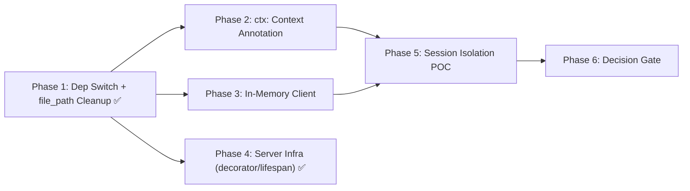

# [PLAN] fastmcp switch investigation (#46)

Spec: #46 — 7 SCs across investigation cards.

## Goal

Investigate switching from `mcp>=1.0.0` (official SDK, bundled FastMCP) to standalone `fastmcp>=3.0,<4.0` (PrefectHQ fork). Produce a decision log with evidence for: `ctx: Context` annotation working, `ctx.session_id` returning non-empty str, in-memory test client viability, and session isolation POC.

## Status Summary

| Card | Status |
|------|--------|
| Card 1 — Dependency Switch | ✅ IMPLEMENTED (135 tests, 7 tools registered) |
| Card 5 — Decorator Compatibility | ✅ CONFIRMED — no code change needed |
| Card 7 — Lifespan Handler | ✅ CONFIRMED — no code change needed |
| Card 6 — Dependency Bloat | ✅ MEASURED — delta +2.6M |
| Card 2 — ctx: Context Annotation | ⬜ PENDING |
| Card 3 — Session Management | ⬜ PENDING |
| Card 4 — In-Memory Client | ⬜ PENDING |

## Dependencies

## Phase 1 — Dependency Switch + file_path Cleanup (Cards 1+6, SC-1, SC-5, SC-6) ✅ DONE

### Item 1a: Add fastmcp dependency ✅
`uv add "fastmcp>=3.0,<4.0"` — resolved to fastmcp 3.4.0. `pyproject.toml` updated.

### Item 1b: Change server import ✅
`from fastmcp import FastMCP` at `server.py:16`. Zero `from mcp.server.fastmcp` remaining in `src/`.

### Item 1c: Remove file_path from edit() test calls ✅
21 `"file_path"` entries removed from `call_tool("edit", ...)` across 4 test files. `test_red_sc6_no_file_path_edit` passes.

### Item 1d: Document install size delta ✅
fastmcp 4.8M, mcp 2.2M (transitive dep). Delta +2.6M. Not the 28.8 MB/621 KB originally cited — corrected.

## Phase 2 — `ctx: Context` Annotation (Card 2, SC-3) ⬜ PENDING

### Item 2a: Annotate all 7 handlers
| Phase | RED | GREEN |
|-------|-----|-------|
| 2a | `grep -c "ctx: Any" src/viewport_editor/server.py` returns 7 | All 7 handlers use `ctx: Context`; `from fastmcp import Context` added; `uvx pyright src/` passes |

### Item 2b: Verify ctx.session_id is non-empty str
| Phase | RED | GREEN |
|-------|-----|-------|
| 2b | Tool returns `None` or `""` for session_id | Tool handler returns non-empty `str` for `ctx.session_id` (behavioral test) |

## Phase 3 — In-Memory Client Fixture (Card 4, SC-5) ⬜ PENDING

### Item 3a: Create shared conftest.py
| Phase | RED | GREEN |
|-------|-----|-------|
| 3a | No `test/conftest.py` exists with in-memory fixture | `test/conftest.py` has `client` fixture using `Client(create_server(...))` from standalone fastmcp |

### Item 3b: Migrate test files (batched 4 groups × 3 files)
Still needs 11 files migrated from `stdio_client` + `ClientSession` to in-memory `Client(server)`.

## Phase 4 — Server Infrastructure Verification (Cards 5+7, SC-2) ✅ DONE

### Item 4a: Decorator compatibility ✅ CONFIRMED
`grep` confirms zero captures of `@mcp.tool()` decorator return value. No code change needed.

### Item 4b: Lifespan handler ✅ CONFIRMED
`_server_lifespan` pattern identical in both SDKs. Server starts and stops cleanly. No code change needed.

## Phase 5 — Session Isolation POC (Card 3, SC-4, SC-7) ⬜ PENDING

### Item 5a: Two clients have different ctx.session_id
Requires Card 2 (Context annotation) + Card 4 (in-memory Client) first.

### Item 5b: ctx.set_state/ctx.get_state demonstrates isolation
Requires Card 3 capability from standalone fastmcp + Card 4 fixtures.

## Phase 6 — Decision Gate ⬜ PENDING

All evidence from Phases 1-5 compiled into decision log.

## SC Evidence Collection

| SC | Evidence Type | Status | Artifact |
|----|---------------|--------|----------|
| SC-1 | `behavioral` (uplifted from structural) | ✅ PASS | Runtime `create_server()` + `list_tools()` — 7 tools confirmed |
| SC-2 | `behavioral` | ⬜ PENDING | Lifespan lifecycle test (Card 7 confirmed no code change needed) |
| SC-3 | `behavioral` | ⬜ PENDING | Tool returns non-empty session_id (Card 2 needed) |
| SC-4 | `behavioral` | ⬜ PENDING | Two clients → different session_ids (Card 3+4 needed) |
| SC-5 | `behavioral` | ✅ PASS | `uv run pytest test/` — 135/135 pass |
| SC-6 | `structural` | ✅ PASS | `du -sh` — fastmcp 4.8M, mcp 2.2M, delta +2.6M |
| SC-7 | `behavioral` | ⬜ PENDING | ctx.set_state/ctx.get_state isolation (Card 3 needed) |