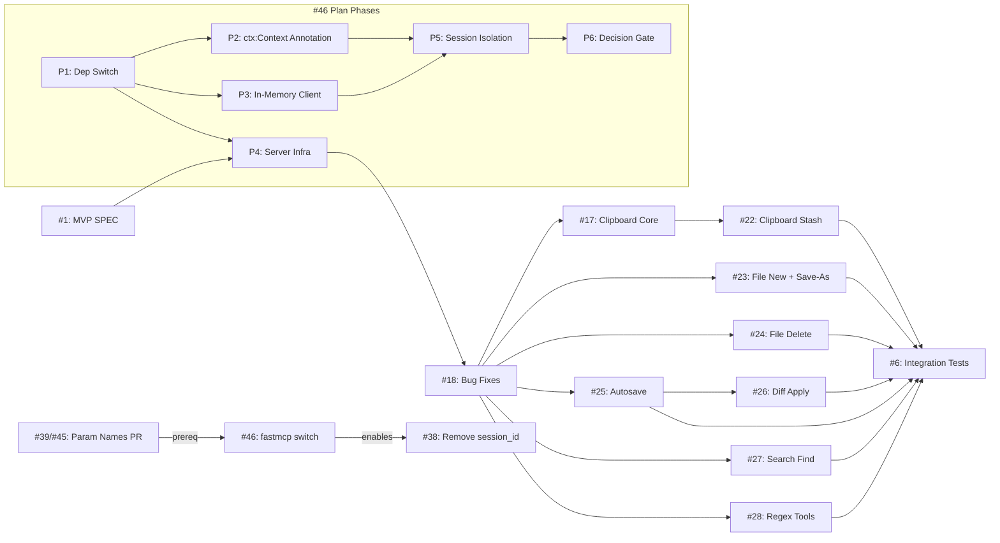

# Issue Cross-Reference Ledger

Tracks dependency and enablement relationships between all open issues.
Maintained at: `.issues/XR.md`

## Dependency Graph

## Entry Index

| # | Title | Type | Status | Prerequisites | Dependents |
|---|-------|------|--------|--------------|------------|
| 1 | MVP: Viewport-Editor MCP Server | SPEC | open | none | #4 |
| 4 | MVP: Viewport-Editor MCP Server | PLAN | open | #1 | #18, #17, #22, #23, #24, #25, #26, #27, #28, #6 |
| 6 | Phase 5: Integration Tests | plan-sub | open | #18, #17, #22, #23, #24, #25, #26, #27, #28 | none |
| 17 | Clipboard Core (copy/cut/paste) | spec | open | #18 | #22 |
| 18 | Bug Fixes (CRLF, mkstemp, close, tests) | spec | open | #4, #13 | #17, #22, #23, #24, #25, #27, #28, #6 |
| 22 | Clipboard Stash | spec | open | #17 | #6 |
| 23 | File New + Save-As | spec | open | #18 | #6 |
| 24 | File Delete | spec | open | #18 | #6 |
| 25 | Autosave Integration | spec | open | #18, #17 | #26, #6 |
| 26 | Diff Apply | spec | open | #25 | #6 |
| 27 | Search Find | spec | open | #18 | #6 |
| 28 | Regex Tools | spec | open | #18 | #6 |
| 38 | Remove session_id, derive from MCP connection | SPEC-FIX | open | #39, #46 | none |
| 39 | Normalize tool parameter naming | SPEC-FIX | closed (PR #45 merged) | none | #46 |
| 46 | Switch from official mcp to standalone fastmcp | SPEC+PLAN | open | #39 | #38 |

## Enablement Map

| Issue | What it enables | For whom |
|-------|----------------|----------|
| #46 (fastmcp switch) | `ctx.session_id` for connection-derived session identity | #38 |
| #18 (bug fixes) | Stable buffer/file operations | #17, #22, #23, #24, #25, #27, #28 |

## Important Notes (do not track progress here)

- #46 is a prerequisite for #38 — without standalone fastmcp, there is no `ctx.session_id`
- #39/#45 is a prerequisite for #46 — `ctx` is now first parameter, making `ctx: Context` annotation clean
- #38 Phase A depends on #46 Cards 2+3 completing (Context annotations + session_id working)